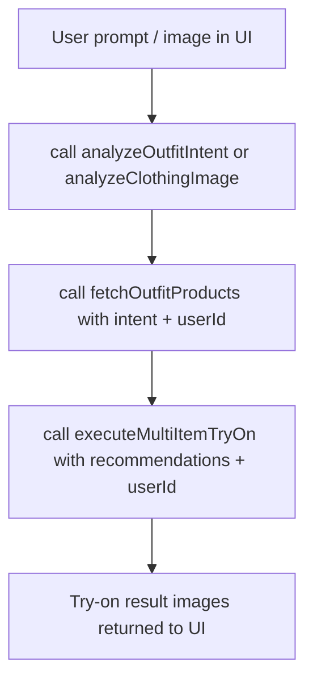

# AI Stylist Experience & Debug Notes

## Overview
This document captures the end-to-end “experience” of wiring the AI outfit generation pipeline into Firebase Callable Functions and fixing the issues encountered during development. It is meant to be reusable by the team (and by future AI agents) as a checklist for similar failures.

The affected callable functions are:
- `analyzeOutfitIntent`
- `analyzeClothingImage`
- `fetchOutfitProducts`
- `executeMultiItemTryOn`

Primary frontend entry:
- `lib/screens/user/ai/beta_ai_studio_screen.dart`

Primary client services:
- `lib/services/ai_outfit_generation_service/ai_outfit_intent_service.dart`
- `lib/services/ai_outfit_generation_service/ai_product_recommendation_service.dart`
- `lib/services/ai_outfit_generation_service/multi_item_try_on_service.dart`

---

## Architecture (Mental Model)
The UI triggers a pipeline that flows through 4 callable steps.

Conceptually:
- Intent analysis produces a structured “occasion/style/categories” output.
- Product fetching translates intent into Firestore queries and returns product candidates per category.
- Multi-item try-on takes one candidate image per category (plus user images) and requests image generation.

---

## Function Contracts (What each callable expects)
### 1) `analyzeOutfitIntent`
**Request**
- `prompt: string`
- `gender?: string`
- `analyzedImages?: Array<{category, color, style}>` (optional)

**Response**
- Parsed JSON intent object (fallback intent if Gemini JSON parse fails)

### 2) `analyzeClothingImage`
**Request**
- `imageBase64: string`
- `mimeType?: string`
- `analyzeAll?: boolean`

**Response**
- If `analyzeAll=false`: `{ category, isValid, ... }` (fallback if parse fails)
- If `analyzeAll=true`: `Array` of analyzed items

### 3) `fetchOutfitProducts`
**Request**
- `intent: OutfitIntent` (includes `itemCategories`, `categorySubcategoryMap`, etc.)
- `productsPerCategory?: number`
- `userId` is required at runtime to track shown products and for consistent filtering

**Behavior**
- Queries `brand_products` by:
  - `schemaVersion == "v1.6"`
  - `isOnline == true`
  - `category.canonical_category == <canonical>`
  - optional `category.canonical_subcategory == <subcategory>`
  - optional gender filtering for non-unisex
- Returns:
  - `recommendations: Array<{ category, products: [...] }>`
  - `failedCategories: string[]`

### 4) `executeMultiItemTryOn`
**Request**
- `recommendations: Array<{ category, products: [...] }>`
- `userProvidedItems?: Array<{ category, imageBase64, mimeType, ... }>`
- `feetVisible?: boolean`
- `handsVisible?: boolean`
- `userId` is required to locate the user images and to save generated images

**Behavior**
- Phase 1: try-on user-provided items (if any)
- Phase 2: try-on 1 product per recommendation bucket (ordered by layering)
- Returns:
  - `finalImageUrl`
  - `itemResults: Array<{ category, success, resultImageUrl, skipped, ... }>`
  - `errorMessage` if everything fails

---

## What Went Wrong (and How It Was Fixed)

### Failure Mode A: `UNAUTHENTICATED` with `No AppCheckProvider installed`
**Symptom**
- Flutter logs showed callable failures with `[firebase_functions/unauthenticated] UNAUTHENTICATED`.
- Android logs also showed:
  - `Error getting App Check token. ... No AppCheckProvider installed.`

**Root Cause**
- Firebase App Check enforcement was enabled (or partially enforced) for Cloud Functions.
- The Flutter client did not have `firebase_app_check` configured, so callable requests were rejected.

**Fixes**
- Add `firebase_app_check` to `frontend/pubspec.yaml`.
- Initialize App Check in `lib/main.dart` after `Firebase.initializeApp()`.
- For dev builds use:
  - `AndroidProvider.debug` (debug provider)
  - `AppleProvider.debug` on Apple
  - a web provider if relevant

Current code location:
- `lib/main.dart`

---

### Failure Mode B: Cloud Run `401 not authorized to invoke this service`
**Symptom**
- Cloud Run logs showed:
  - `The request was not authorized to invoke this service ... status=401`
- This was independent of App Check and indicates Cloud Run IAM blocking invocation.

**Root Cause**
- Some callable functions were deployed without the expected public invoker behavior.

**Fix**
- In `functions/src/functions/ai-stylist.ts` set `invoker: "public"` on the 4 callables.
- Keep `enforceAppCheck: false` for development safety (while App Check is being set up).

Code locations:
- `functions/src/functions/ai-stylist.ts`

---

### Failure Mode C: `executeMultiItemTryOn` fails with Gemini `429 RESOURCE_EXHAUSTED`
**Symptom**
- Server logs show:
  - `RESOURCE_EXHAUSTED ... generateContent ... 429 Too Many Requests`
  - `Quota exceeded ... Please retry in 18h...`

**Root Cause**
- The Gemini image-generation quota is exhausted for the day/model.

**Fixes**
- Add detection for quota errors inside try-on flow:
  - In `generateVirtualTryOn`, detect `resource_exhausted/quota/429 too many requests`.
  - Short-circuit the loop in `executeMultiItemTryOn` and return a clean message:
    - `AI try-on quota reached. Please try again later.`

Code location:
- `functions/src/functions/ai-stylist.ts`

---

### Failure Mode D: Flutter crash parsing returned products (`_Map<Object?, Object?>`)
**Symptom**
- After calls started working, Flutter crashed while creating product models:
  - `type '_Map<Object?, Object?>' is not a subtype of type 'Map<String, dynamic>?'`

**Root Cause**
- Callable responses include nested maps with non-string keys as returned by the platform channel.
- Direct casts like `Map<String, dynamic>.from(...)` failed for nested fields.

**Fix**
- In `ai_product_recommendation_service.dart`, deep-normalize response maps:
  - Recursively convert any `Map` keys to `String` keys
  - Recursively normalize nested lists/maps before calling `Product.fromJson`

Code location:
- `lib/services/ai_outfit_generation_service/ai_product_recommendation_service.dart`

---

## Debugging Instrumentation Added
To make future failures easier to diagnose, logs were added in:
- `functions/src/functions/ai-stylist.ts`

Log goals:
- confirm whether requests reach the handler
- record prompt/intent previews (not full base64)
- record what Firestore query is being executed and the number of results returned
- confirm which user image was selected for try-on
- surface quota-specific failures early

---

## Reusable Debug Checklist
When you see callable failures:

### Step 1: Determine stage of failure
- If Flutter shows `firebase_functions/unauthenticated`:
  - check App Check provisioning
  - check Cloud Run invoker IAM
- If you see Cloud Run `401 not authorized to invoke`:
  - ensure `invoker: "public"` or bind `roles/run.invoker` for the service
- If you see `429 RESOURCE_EXHAUSTED`:
  - it is quota; stop retry loops and show clean messaging

### Step 2: Redeploy only the relevant functions
Use:
- `firebase deploy --only "functions:<name>"`

### Step 3: Add one targeted log timestamp
Trigger a single request from the UI, then correlate:
- request time
- function handler logs
- client error block

---

## Known Edge Cases
- Guests:
  - The UI should sign in anonymously before calling callables that require `userId`.
  - `executeMultiItemTryOn` needs AI Studio user images; guests without uploads will fail with a precondition message.
- Quota:
  - Even with perfect code, try-on can fail due to Gemini quota.
  - Always fail gracefully for `429 RESOURCE_EXHAUSTED`.
- Firestore mapping:
  - Ensure `schemaVersion` and `category.canonical_category` / `canonical_subcategory` match the stored document structure.

---

## Notes for Landing Page Integration
To expose the AI experience from another entry point (e.g., landing page CTA), reuse the same services:
- `AIOutfitIntentService`
- `AIProductRecommendationService`
- `MultiItemTryOnService`

The landing CTA should route users into the same flow as:
- `beta_ai_studio_screen.dart`

If user is a guest:
- ensure anonymous sign-in happens before calling functions that require `userId`.

